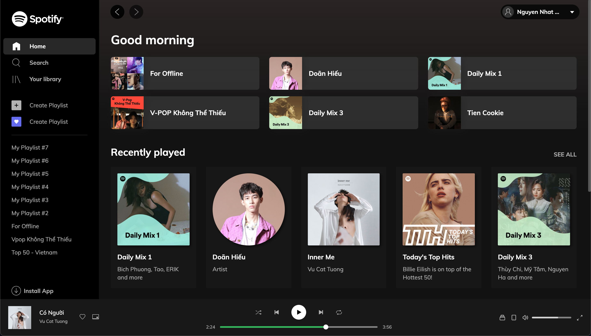

# A clone of Spotify's main page using Vue and Tailwind

### Screenshot:



### Feel free to use:

```sh
    git clone https://github.com/nhhao/vue-spotify.git
    cd vue-spotify
    yarn        #npm install
    yarn dev    #npm run dev
```

> It's free to give it a star ⭐️ if it work! 🤣
